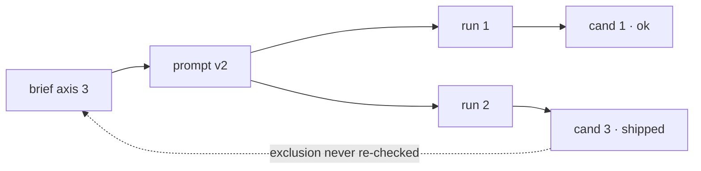

<!-- quality:deferred -->
Purpose: the copy-paste form for each trigger, so a diagram costs a minute rather than a decision.
Read when: a finding has hit one of the triggers and the shape is not obvious.
Verified: 2026-08-23 — no automated check reads the drawings. What is checked is
that this page and `visualise` between them define every trigger, form and floor
word the registry declares; a rule in `quality-tools/validate.py` re-runs that on
every commit, so a word deleted from here fails the build.

# Forms

Four shapes cover almost everything. Pick by trigger, not by taste.

## `disagreement` — the claim ledger

The default here. One row per claim, the rung it carries against the rung its
kind requires, and the gap on its own line.

```
claim                          carries   floor   
"the handler leaks on retry"   E1        E2      ← under floor, ships as HYPOTHESIS
"the migration is reversible"  E3        E3      ok
"this is slower than before"   E0        E2      ← reasoning alone; never ships
```

Also the form for severity against blocking, and for a count claimed against a
count of root causes.

## `location` — the coverage grid

What the diff touched down one axis, what ran across the other. The empty cell
is the finding, and a blank shows it faster than a paragraph saying nothing ran.

```
                    unit   integration   manual
auth/session.ts      ok        ok          --
db/user.ts           ok        ——          --    ← changed, no integration cover
api/handler.ts       ——        ——          ok    ← manual only
```

## `hops` — the evidence chain

When a claim rests on another claim. Each link names what was run and what it
showed; mark the link that is reasoning alone.

```
"unsafe on retry" ──▶ "the lock is not re-entrant" ──▶ "two calls can interleave"
                              │                                │
                              E2: ran it, deadlocked           E0: nobody traced it
                                                               ▲ the chain's floor
```

## `ordering` — two lanes

Only when the sequence is the finding: a check that ran before the thing it was
supposed to check, a gate applied after the merge.

```
review  ──▶ approve ──▶ merge
                 │           │
                 │           └─ CI first ran here
                 └─ approved against a green that predates the last push

## Mermaid, when it is a graph

More than about six nodes, or branching and merging that ASCII would misalign.
It needs a renderer, so it is a trade.

````

````

Keep node labels to what was opened. A mermaid graph is as easy to fill with
untraced edges as a sentence is, and harder to argue with, which is the danger.

## Drawing them

- Box characters `┌ ┐ └ ┘ ├ ┤ ┬ ┴ ┼ │ ─`, arrows `──▶ ▲ ▼ └─`
- Keep the whole thing under about 70 columns so nothing wraps in a terminal
- Circled numbers `① ② ③` for marks; they survive being pasted anywhere
- Align by spaces, never tabs
- A legend under the drawing, not inside it

## What none of these do

They do not carry evidence. A map shows where a finding is, not that anyone
looked — the grade beside the finding says that, and a beautifully drawn
`asserted` is still `asserted`.
